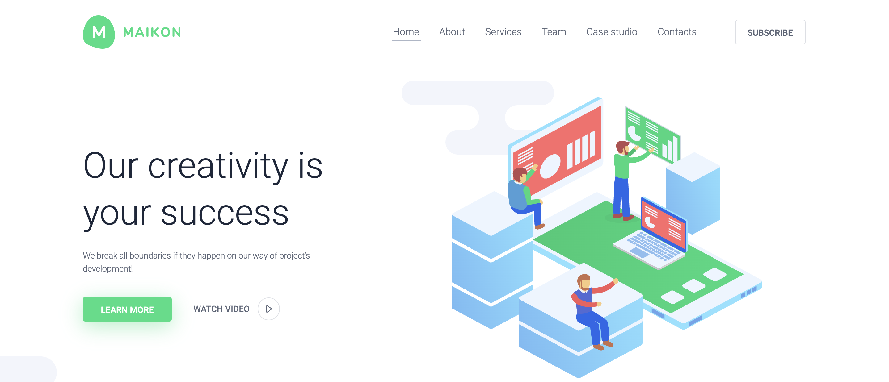

# MAIKON - 網頁切版
成品: [點擊觀看成品](https://loking23.github.io/MAIKON-Weblayout/)

實作方式：透過Chrome的套件將目標網頁的圖片下載後，以純 HTML 與 CSS 刻出與目標網頁一模一樣的畫面

- 目標網頁: [MAIKON 官網](https://ld-wp73.template-help.com/monstroid2/skins/maikon/)  
- [切版紀錄（時間、問題點）](https://github.com/LoKing23/MAIKON-Weblayout/blob/master/NOTE.md)

## 目標
- HTML語意正確
- 統一HTML、CSS 撰寫風格
- 檢視切版速度

透過切版、code review 檢視自己的程式碼需要改進的地方，這次較大的改進是 coding style 的一致性，期望未來再看到這個 code 可以馬上進入狀況